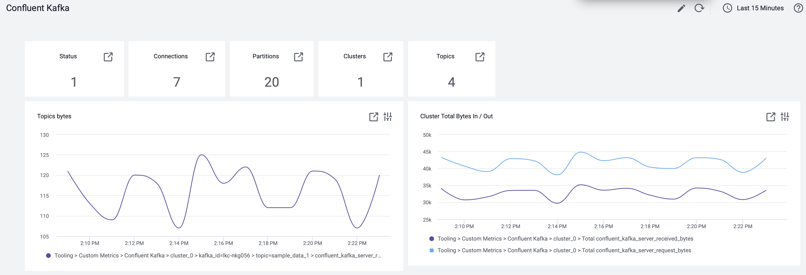
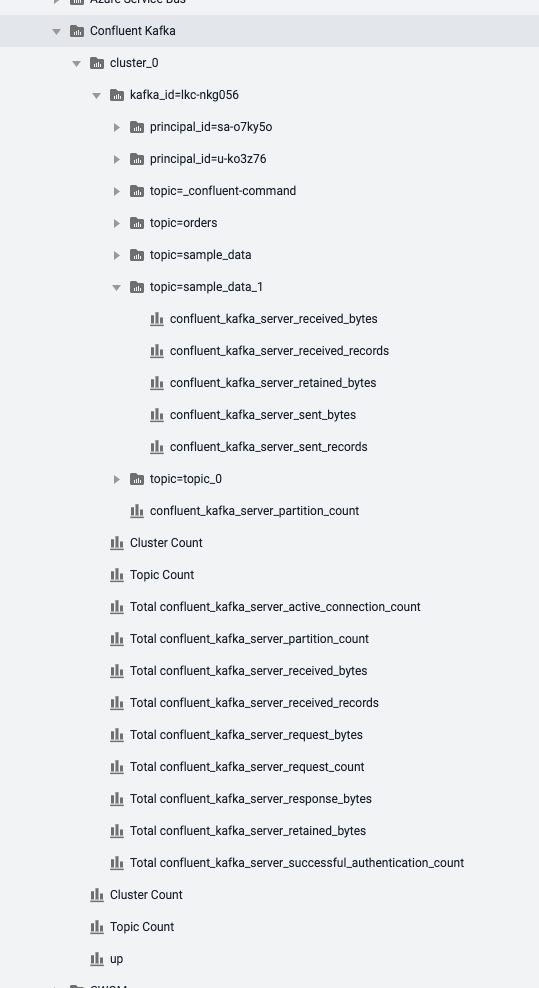

# AppDynamics Confluent Kafka Machine Agent Extension

This extension adds the ability to monitor Confluence Kafka externally and create dashboards from that data

To install this extension, download the release from (https://github.com/jbsouthe/Confluent-Kafka-AppDynamics-Extension/releases)
unzip and place the subdirectory into the machine agent install ./monitors directory. Then edit the Confuent-Config-EXAMPLE.json file for your environment and update the monitor.xml to point to this new configuration:

    <task-arguments>
    <argument name="ConfluentConfigFile" is-required="true" default-value="Confluent-Config-EXAMPLE.json" />
    </task-arguments>

The Confuence-Config-EXAMPLE.json looks like this:

    [
        {
            "id": "lkc-nkg056",
            "name": "cluster_0",
            "url": "https://api.telemetry.confluent.cloud",
            "apiKey": "your key",
            "apiSecret": "your secret",
            "ignoreHiddenTopics": true
        }
    ]

* id, the cluster id to monitor
* name, a name to use in appdynamics, when organizing the metrics
* url, the confluence api endpoint to use 
* apiKey and apiSecret, are the authentication information to use on the url provided for export data
* ignoreHiddenTopics, simply ignores topics named starting with '_' in the summation metrics, but displays them individually

once running, the metric browser should look like this, and within the tree are metrics Confluence makes available for monitoring:

